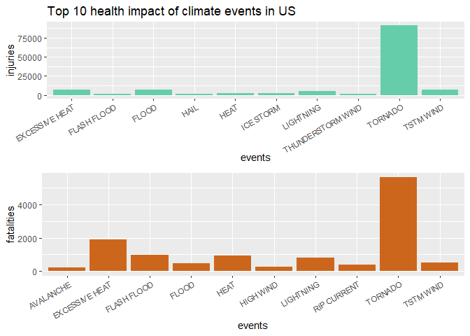
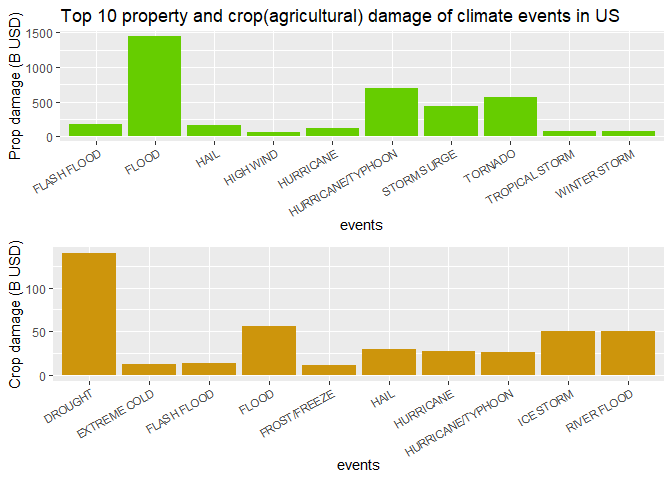

# 1. Synopsis
This is the report of "Reproducible Research Project 2" of Coursera.
Storms and other severe weather events can cause both public health and economic problems for communities and municipalities. Many severe events can result in fatalities, injuries, and property damage, and preventing such outcomes to the extent possible is a key concern.
This project involves exploring the U.S. National Oceanic and Atmospheric Administration's (NOAA) storm database. This database tracks characteristics of major storms and weather events in the United States, including when and where they occur, as well as estimates of any fatalities, injuries, agricultural and property damage.

# 2. Data processing
The data can be downloaded from the course web site: [Storm Data]("https://d396qusza40orc.cloudfront.net/repdata%2Fdata%2FStormData.csv.bz2") .
There is also some documentation of the database available. Here you will find how some of the variables are constructed/defined.

- [National Weather Service Storm Data Documentation]("https://d396qusza40orc.cloudfront.net/repdata%2Fpeer2_doc%2Fpd01016005curr.pdf")

- [National Climatic Data Center Storm Events FAQ]("https://d396qusza40orc.cloudfront.net/repdata%2Fpeer2_doc%2FNCDC%20Storm%20Events-FAQ%20Page.pdf")

The events in the database start in the year 1950 and end in November 2011. In the earlier years of the database there are generally fewer events recorded, most likely due to a lack of good records. More recent years should be considered more complete.

## 2.1 Initial setting

The package libraries are used in this analysis.

```r
library(dplyr)
```

```
## 
## Attaching package: 'dplyr'
```

```
## The following objects are masked from 'package:stats':
## 
##     filter, lag
```

```
## The following objects are masked from 'package:base':
## 
##     intersect, setdiff, setequal, union
```

```r
library(plyr)
```

```
## -------------------------------------------------------------------------
```

```
## You have loaded plyr after dplyr - this is likely to cause problems.
## If you need functions from both plyr and dplyr, please load plyr first, then dplyr:
## library(plyr); library(dplyr)
```

```
## -------------------------------------------------------------------------
```

```
## 
## Attaching package: 'plyr'
```

```
## The following objects are masked from 'package:dplyr':
## 
##     arrange, count, desc, failwith, id, mutate, rename, summarise,
##     summarize
```

```r
library(ggplot2)
library(grid)
library(gridExtra)
```

```
## 
## Attaching package: 'gridExtra'
```

```
## The following object is masked from 'package:dplyr':
## 
##     combine
```

```r
Sys.setlocale("LC_TIME","C")
```

```
## [1] "C"
```

## 2.2 Read data

First of all, read the data and store them to "da".

```r
url <- "https://d396qusza40orc.cloudfront.net/repdata%2Fdata%2FStormData.csv.bz2"
bz2file <- "StormData.csv.bz2"
if (!file.exists(bz2file)) download.file(url, bz2file)
if (!exists("da")) da <- read.csv(bz2file)
dim(da)
```

```
## [1] 902297     37
```

```r
head(da)
```

```
##   STATE__           BGN_DATE BGN_TIME TIME_ZONE COUNTY COUNTYNAME STATE
## 1       1  4/18/1950 0:00:00     0130       CST     97     MOBILE    AL
## 2       1  4/18/1950 0:00:00     0145       CST      3    BALDWIN    AL
## 3       1  2/20/1951 0:00:00     1600       CST     57    FAYETTE    AL
## 4       1   6/8/1951 0:00:00     0900       CST     89    MADISON    AL
## 5       1 11/15/1951 0:00:00     1500       CST     43    CULLMAN    AL
## 6       1 11/15/1951 0:00:00     2000       CST     77 LAUDERDALE    AL
##    EVTYPE BGN_RANGE BGN_AZI BGN_LOCATI END_DATE END_TIME COUNTY_END
## 1 TORNADO         0                                               0
## 2 TORNADO         0                                               0
## 3 TORNADO         0                                               0
## 4 TORNADO         0                                               0
## 5 TORNADO         0                                               0
## 6 TORNADO         0                                               0
##   COUNTYENDN END_RANGE END_AZI END_LOCATI LENGTH WIDTH F MAG FATALITIES
## 1         NA         0                      14.0   100 3   0          0
## 2         NA         0                       2.0   150 2   0          0
## 3         NA         0                       0.1   123 2   0          0
## 4         NA         0                       0.0   100 2   0          0
## 5         NA         0                       0.0   150 2   0          0
## 6         NA         0                       1.5   177 2   0          0
##   INJURIES PROPDMG PROPDMGEXP CROPDMG CROPDMGEXP WFO STATEOFFIC ZONENAMES
## 1       15    25.0          K       0                                    
## 2        0     2.5          K       0                                    
## 3        2    25.0          K       0                                    
## 4        2     2.5          K       0                                    
## 5        2     2.5          K       0                                    
## 6        6     2.5          K       0                                    
##   LATITUDE LONGITUDE LATITUDE_E LONGITUDE_ REMARKS REFNUM
## 1     3040      8812       3051       8806              1
## 2     3042      8755          0          0              2
## 3     3340      8742          0          0              3
## 4     3458      8626          0          0              4
## 5     3412      8642          0          0              5
## 6     3450      8748          0          0              6
```

## 2.3 Simplify data

In order to handle the data simply for this analysis in the project, the subset "da.storm" is created only with **"EVTYPE, FATALITIES, INJURIES, PROPDMG, PROPDMGEXP, CROPDMG, CROPDMGEXP"**.

```r
da.storm<-select(da, EVTYPE, FATALITIES, INJURIES, PROPDMG, PROPDMGEXP, CROPDMG, CROPDMGEXP)
```

## 2.4 Converting units and changing the data type

The exponential values are stored in a separate column describing their value with letters such as h|H = hundred, k|K = thousand, m|M = million, b|B = billion. Blanks are replaced with "0". They are converted to the actual numbers with "gsub()". 

```r
unique(da.storm$PROPDMGEXP)
```

```
##  [1] K M   B m + 0 5 6 ? 4 2 3 h 7 H - 1 8
## Levels:  - ? + 0 1 2 3 4 5 6 7 8 B h H K m M
```

```r
unique(da.storm$CROPDMGEXP)
```

```
## [1]   M K m B ? 0 k 2
## Levels:  ? 0 2 B k K m M
```


```r
da.storm$PROPDMGEXP <- gsub("?|-|+",        "0", da.storm$PROPDMGEXP)
da.storm$PROPDMGEXP <- gsub("1",           "10", da.storm$PROPDMGEXP)
da.storm$PROPDMGEXP <- gsub("H|h|2",      "100", da.storm$PROPDMGEXP)
da.storm$PROPDMGEXP <- gsub("K|k|3",     "1000", da.storm$PROPDMGEXP)
da.storm$PROPDMGEXP <- gsub("4",        "10000", da.storm$PROPDMGEXP)
da.storm$PROPDMGEXP <- gsub("5",       "100000", da.storm$PROPDMGEXP)
da.storm$PROPDMGEXP <- gsub("M|m|6",  "1000000", da.storm$PROPDMGEXP)
da.storm$PROPDMGEXP <- gsub("7",     "10000000", da.storm$PROPDMGEXP)
da.storm$PROPDMGEXP <- gsub("8",    "100000000", da.storm$PROPDMGEXP)
da.storm$PROPDMGEXP <- gsub("B|b", "1000000000", da.storm$PROPDMGEXP)
da.storm$PROPDMGEXP[da.storm$PROPDMGEXP==""]<-"0"
da.storm$PROPDMGEXP <- as.numeric(as.character(da.storm$PROPDMGEXP))

da.storm$CROPDMGEXP <- gsub("?",            "0", da.storm$CROPDMGEXP)
da.storm$CROPDMGEXP <- gsub("H|h|2",      "100", da.storm$CROPDMGEXP)
da.storm$CROPDMGEXP <- gsub("K|k|3",     "1000", da.storm$CROPDMGEXP)
da.storm$CROPDMGEXP <- gsub("M|m",    "1000000", da.storm$CROPDMGEXP)
da.storm$CROPDMGEXP <- gsub("B|b", "1000000000", da.storm$CROPDMGEXP)
da.storm$CROPDMGEXP[da.storm$CROPDMGEXP==""]<-"0"
da.storm$CROPDMGEXP <- as.numeric(as.character(da.storm$CROPDMGEXP))
```

## 2.5 Injury and Fatal

The number of injuries and fatalities caused by each climate event are calculatd.


```r
fat.inj <- ddply(da.storm, .(EVTYPE), summarize, fatalities = sum(FATALITIES),
                 injuries = sum(INJURIES))
injury <- fat.inj[order(fat.inj$injuries, decreasing=TRUE),]
fatal  <- fat.inj[order(fat.inj$fatalities, decreasing=TRUE),]
```

## 2.6 Property and crop (agricultural) damage

Total damage of property and crop by each climate event are calculated. The amount will be shown in billion US dollars (B USD). If 


```r
da.storm$PROPDMGEXP[is.na(da.storm$PROPDMGEXP)] <- 0
da.storm$prop <- da.storm$PROPDMG * da.storm$PROPDMGEXP / 10^9
propsum <- aggregate(prop~EVTYPE, data=da.storm, FUN=sum)
propsum <- propsum[order(propsum$prop, decreasing=TRUE),]

da.storm$CROPDMGEXP[is.na(da.storm$CROPDMGEXP)] <- 0
da.storm$crop <- da.storm$CROPDMG * da.storm$CROPDMGEXP / 10^9
cropsum <- aggregate(crop~EVTYPE, data=da.storm, FUN=sum)
cropsum <- cropsum[order(cropsum$crop, decreasing=TRUE),]
```

# 3. Results
## 3.1 Injury and Fatal

The following charts show the injuries and fatalities by the top-10 climate events. **Tornado** is the worst in both injuries and fatalities.


```r
p.injury <- ggplot(data=head(injury,10), aes(x=EVTYPE, y=injuries)) +
  geom_bar(stat="identity", fill="aquamarine3") +
  xlab("events") +
  ggtitle("Top 10 health impact of climate events in US") +
  theme(axis.text.x=element_text(size = 8, angle=30, vjust=1, hjust=1))
p.fatal <- ggplot(data=head(fatal,10), aes(x=EVTYPE, y=fatalities)) +
  geom_bar(stat="identity", fill="chocolate3") +
  xlab("events") +
  theme(axis.text.x=element_text(size = 8, angle=30, vjust=1, hjust=1))
grid.arrange(p.injury, p.fatal, nrow=2)
```

<!-- -->

## 3.2 Property and crop (agricultural) damage

The following charts show the property and crop (agricultural) damage by the top-10 climate events. The worst property damage is **Flood**, over 1T USD. And **Hurricane/Typhoon**, **Tornado**, **Storm surge** are also significant.  
The worst crop damage is **Drought**, over 100B USD, and **Flood**, **Ince storm**, **River flood** are also significant.


```r
p.prop <- ggplot(data=head(propsum,10), aes(x=EVTYPE, y=prop)) +
  geom_bar(stat="identity", fill="chartreuse3") +
  labs(x="events", y="Prop damage (B USD)") +
  theme(axis.text.x=element_text(size = 8, angle=30, vjust=1, hjust=1)) +
  ggtitle("Top 10 property and crop(agricultural) damage of climate events in US")
p.crop <- ggplot(data=head(cropsum,10), aes(x=EVTYPE, y=crop)) +
  geom_bar(stat="identity", fill="darkgoldenrod3") +
  labs(x="events", y="Crop damage (B USD)") +
  theme(axis.text.x=element_text(size = 8, angle=30, vjust=1, hjust=1))
grid.arrange(p.prop, p.crop, nrow=2)
```

<!-- -->
